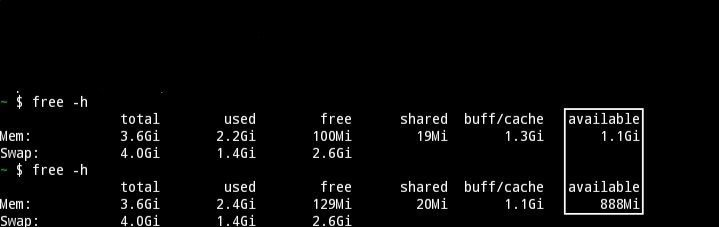
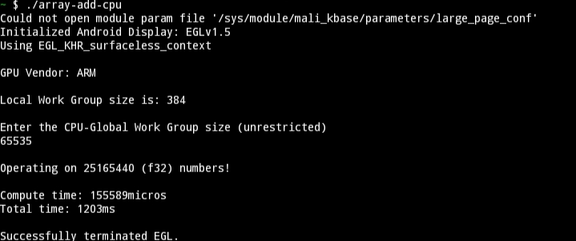
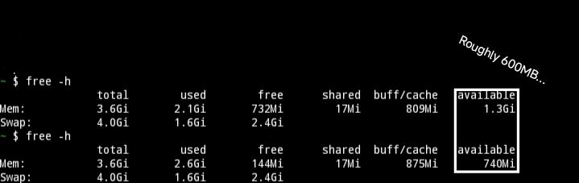
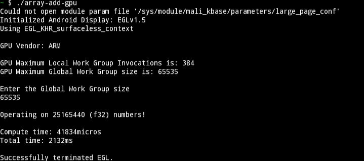
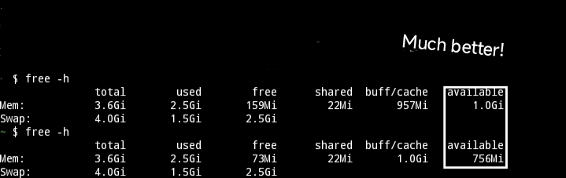
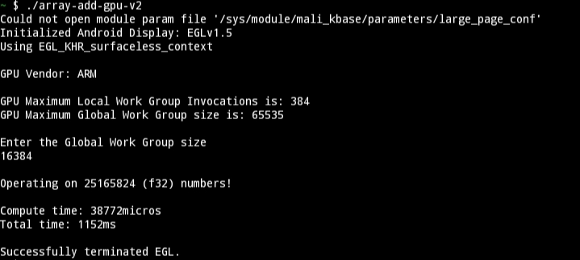
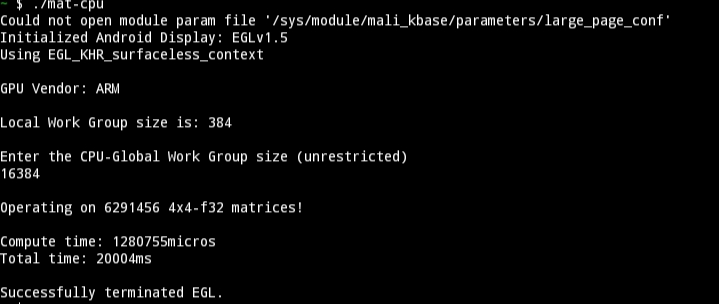
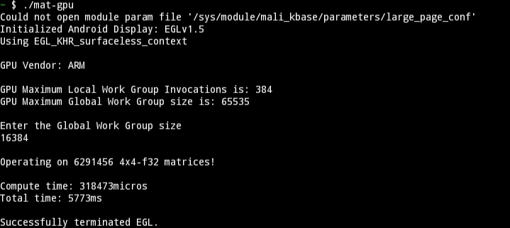

# Android-GPU-Compute-Talk
WEC talk - GPU Compute on Android (using OpenGLES Compute)!

## Prerequisites
+ Excellent C programming skills
+ An Android phone, running Android 11 or newer and
+ `Termux` app installed on that phone

## Project Structure
No need to panic looking at this huge project.

This is all you need to look at:
```
.
├── Resources -------(Books/Slides)
|
├── array-add-cpu ---(Adding 2 arrays on CPU)
|
├── array-add-gpu ---(Adding 2 arrays on GPU)
|
├── array-add-gpu-v2 (Adding 2 arrays on GPU-v2)
|
├── mat-cpu ---------(4x4 Matrix mult. on CPU)
|
├── mat-gpu ---------(4x4 Matrix mult. on GPU)
|
├── src -------------(Main Library and C code)
|
├── shaders ---------(ESSL shader source)
|
├── README.md -------(Read this FIRST, ofc)
|
├── LICENSE ---------(Read this, ofc)
|
└── Ignore all others!
```

## Performance Stats
On my phone (Mediatek Helio-G85 SOC and 4GB RAM), I ran
tests with 3 arrays (f32), each having 65535 x 384 elements (f32s) in all cases.
The array is around 96MiB each.

CPU variant:
>Compute time: ~140ms  
>Total time:   ~1.2s  
>RAM consumed:  
>  
>Output:  
>

GPU variant:
>Compute time: ~39ms  
>Total time:   ~1.3s  
>RAM consumed:  
>  
>Output:  
>

GPU variant-v2: *(Uses Hardware Buffers)*
>Compute time: ~37ms  
>Total time:   ~1.1s  
>RAM consumed:  
>  
>Output:  
>

When the Array has 262140 x 384 elements, we see the following numbers:

CPU variant:
>Compute time: ~600ms  
>Total time:   ~4.8s  
>RAM consumed: ~1.2GB

GPU variant: **Out of Memory**

GPU variant-v2: *(Uses Hardware Buffers)*
>Compute time: ~135ms  
>Total time:   ~4.2s  
>RAM consumed: ~1.2GB

When doing 4x4 (f32) Matrix multiplication with 16384 x 384 matrices,
we see the following:

CPU variant:
>Compute time: ~700ms  
>Total time:   ~20s  
>Output:  
>

GPU variant: *(Uses Hardware Buffers)*
>Compute time: ~250ms  
>Total time:   ~4.6s  
>Output:  
>

To see real benefits, the operation needs to be math-heavy and
you need to queue up a ton of work!

These values are device dependent. Its just for illustration!

### Build prerequisites
I recommend you to download the pre-compiled binaries which can be found in the releases section.

However, if you want to build/compile this project on your machine, youll need:

+ Linux or MacOS
+ GNU `make`
+ Android NDK (LTS version)
+ `clang`, `llvm-ar`, `lld`, `rustc` (2024 edition) and `cargo`

Before building, **you must** update the NDK_HOME variable in the Makefile. 
After that, run the following to build everything:
```bash
make
```

All the executables can be found in `target/aarch64-linux-android/release` folder.
You will also need the `shaders` folder for the programs to work properly.

NOTE: The executables run ONLY on Android-Aarch64 devices!
